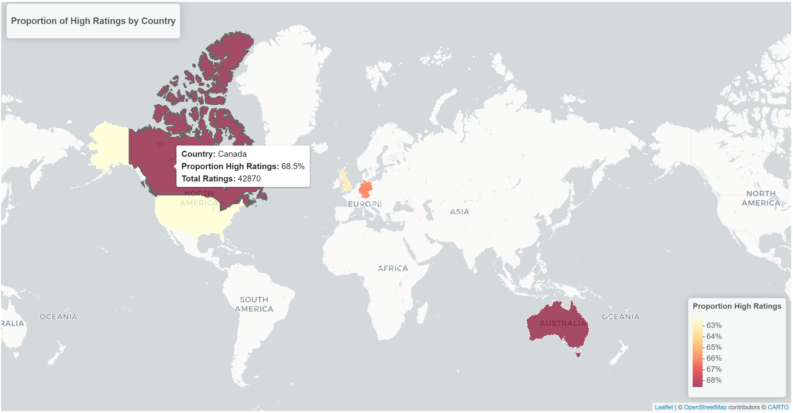
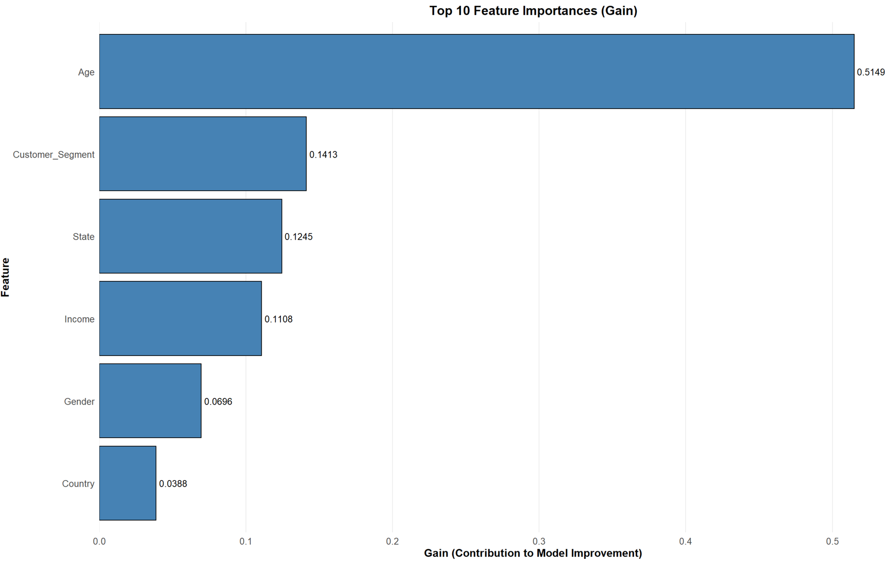
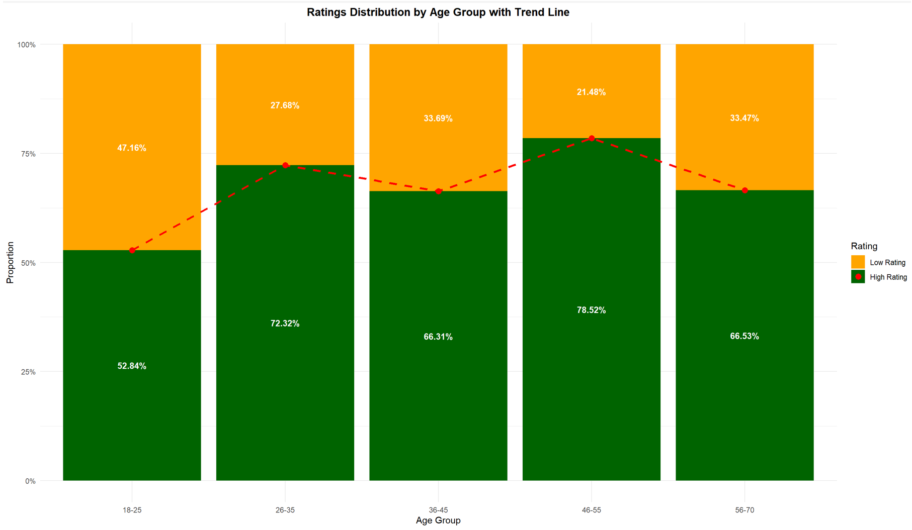
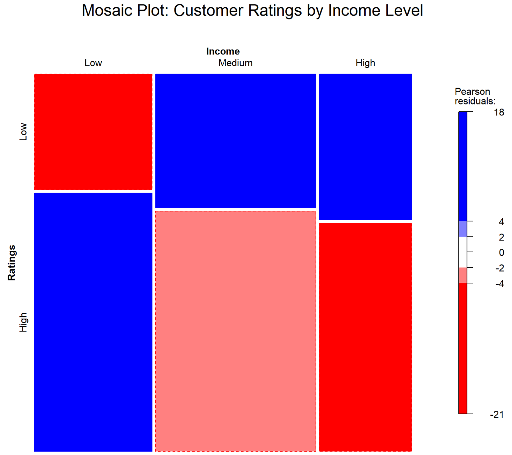

# **Retail Customer Satisfaction: Demographic & Geographic Analysis**



This repository contains the R scripts for the individual component of a retail analytics project by **Low Wei Ling (TP080089)**.

Because of file size limits, the dataset files are **not included** in this repository. You must provide the raw dataset locally to run the scripts.

The project covers two major components:

* **Strict Data Engineering Pipeline** (high-integrity cleaning, no imputation)
* **Demographic & Geographic Analysis** (Objective 2 of the project)

---

## 📁 **Repository Structure**

| File                        | Description                                                                                                                                               |
| --------------------------- | --------------------------------------------------------------------------------------------------------------------------------------------------------- |
| **cleaning.R**              | Strict Cleaning Pipeline: A full validation and cleaning script enforcing data consistency, removing invalid records, and producing a 100% clean dataset. |
| **TP080089 LOW WEI LING.R** | Individual Analysis Script: Performs demographic & geographic analysis for Objective 2.                                                                   |

> ⚠️ **Data files (retail_data.csv, complete_data.csv, complete_data_recreated.csv) are NOT included** because of size limitations.
> Place them in the root folder manually before running the scripts.

---

## 🛠️ **Part 1: Strict Data Cleaning Pipeline (cleaning.R)**

The pipeline applies a **Strict Validation Approach**, meaning:

* ❌ No guessing
* ❌ No imputing
* ❌ No statistical filling

Instead, it aims for **true data integrity** by removing invalid or inconsistent rows.

### ✅ **Key Validation Features**

#### **1. Diagnostics First**

Before cleaning begins, the pipeline computes:

* Min/max distributions
* Frequency counts
* Outlier checks

This provides scientific justification for cleaning boundaries
(e.g., proving that *Zipcodes shorter than 4 digits* are statistically incorrect).

#### **2. Logic Enforcement**

**Financial rules**

* Ensures
  `Total_Amount ≈ Amount × Total_Purchases`
* Flags and removes financial inconsistencies

**Demographic rules**

* Age must be within **18–100**
* Zipcode length must be **4–5 digits**
* Phone length **10–12 digits**

**Format standardization**

* Title Case applied to all location fields
  (“new york” → **“New York”**)
* Whitespace trimmed
* Empty strings converted to NA

#### **3. Zero-Tolerance Data Integrity**

At the end of the pipeline:

* 0 missing values
* 0 empty strings
* 0 invalid formats
* 0 corrupted financial rows

The output is a strictly clean dataset suitable for analysis.

---

## 📊 **Part 2: Demographic & Geographic Analysis (TP080089 LOW WEI LING.R)**

This component investigates:

> **Which demographic and geographic factors influence customer satisfaction ratings?**

### 🤖 **Machine Learning Insights**
The following feature importance plot (derived from XGBoost) highlights the key drivers of satisfaction:



### 🔍 **Major Findings**

#### ⭐ **1. Age is the Most Influential Predictor**

Using **Chi-Square** and **Cramér’s V**, age showed the strongest relationship with customer ratings.

* Older customers (**46+**) report higher satisfaction
* Younger customers (**18–25**) tend to rate lower



#### 💸 **2. The Income Paradox**

Higher income groups show **slightly lower satisfaction**, suggesting:

* Wealthier customers have higher expectations
* They are more critical of service quality



#### 🌍 **3. Geography Has a Smaller Impact**

While there are differences across locations (e.g., Canada vs. USA):

* Demographics influence satisfaction **more than** geography
* Spatial factors explain much less variance than age or income

---

## 🚀 **How to Run This Project**

### **1. Install Required Libraries**

```r
install.packages(c(
  "dplyr", "stringr", "ggplot2", "vcd", "caret",
  "randomForest", "xgboost", "leaflet", "sf",
  "rnaturalearth", "rnaturalearthdata"
))
```

---

### **2. Prepare the Data**

Place the raw file:

```
retail_data.csv
```

in the **root directory** of this project.

---

### **3. Run the Cleaning Pipeline**

This generates the fully cleaned dataset:

```r
source("cleaning.R")
```

Output:

```
complete_data_recreated.csv
```

---

### **4. Run the Analysis Script**

Once the cleaned data exists, run:

```r
source("TP080089 LOW WEI LING.R")
```

This produces:

* Summary tables
* Statistical test results
* Visualizations
* Interpretation outputs used in your report

